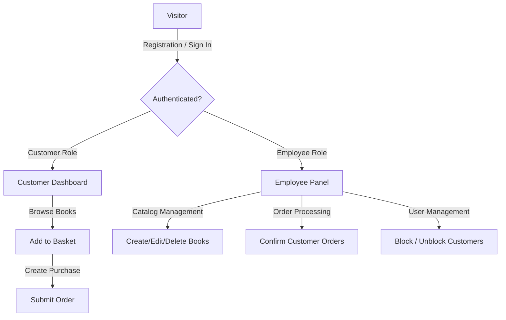

# 📚 Book Store Service

[](https://spring.io/projects/spring-boot)
[](https://spring.io/projects/spring-security)
[](https://www.docker.com/)
[](https://openjdk.org/projects/jdk/17/)

Welcome to the **Book Store Service**—a robust, production-ready enterprise e-commerce platform built on Spring Boot, designed to streamline operations for bookstore managers (employees) and offer a seamless book purchasing experience for readers (customers). 

Inspired by the challenge of moving traditional bookstores into a high-performance digital space, this project combines modern software engineering patterns, role-based access control, automated database seeding, and containerized deployment pipelines.

---

## 🎨 System Architecture & Domain Model

The service is built following clean **MVC (Model-View-Controller)** principles. Below is the domain model diagram visualizing entity relationships and authentication schemas:

<p align="center">
  
</p>

### Interactive User Flows


---

## 🛠️ Technology Stack & Tools

* **Core Framework**: `Spring Boot 3.2.1` & `Java 17`
* **Security & Authentication**: `Spring Security 6` (JWT-based session authentication for APIs, role-based URL authorization filters)
* **Persistence Layer**: `Spring Data JPA` / `Hibernate ORM`
* **Databases**: `MySQL 8.0` (Production) & `H2 Database` (In-memory testing)
* **Templating Engine**: `Thymeleaf` with `thymeleaf-extras-springsecurity6` integration
* **Mapping & Utility**: `ModelMapper` (DTO mapping) & `Lombok` (boilerplate reduction)
* **DevOps & Containerization**: `Docker` & `Docker Compose`
* **Quality Assurance**: `JUnit 5`, `Mockito`, and `Spring Security Test`

---

## 🔐 Roles and Permissions

The system operates with two distinct privilege tiers:

### 👤 Customer (Reader)
* **Basket Management**: Add books to the basket, manage quantities, and delete items.
* **Order Processing**: Place orders and track order histories.
* **Profile Management**: Edit personal details, view balance, and request account deletion.

### 💼 Employee (Manager)
* **Catalog Control**: Full CRUD operations on the book catalog (add, update, delete books).
* **Order Confirmation**: Manage and approve pending client orders.
* **User Control**: Access list of registered customers, and block/unblock customer accounts to maintain system security.

---

## 📂 Project Structure & Packages

* `conf`: System-wide beans, custom filters (`LocaleFilter`, `JwtAuthenticationFilter`), and Spring Security settings.
* `controller`: Web and API endpoints orchestrating data flow.
* `dto`: Clean, isolated data structures mapping view models to JPA models.
* `model`: Database entities (`Book`, `Client`, `Employee`, `Order`, `BookItem`).
* `repo`: Query layers extending `JpaRepository` for custom database searches.
* `service` & `impl`: Core business logic encapsulation, sorting, and user verification.

---

## 🚀 Setup & Execution Guide

You can run the application either inside Docker containers (recommended) or locally on your host machine.

### Method A: Running via Docker Compose (Recommended)
This runs the application alongside a dedicated MySQL database container, with zero local database installation required.

#### Prerequisites
* [Docker Desktop](https://www.docker.com/products/docker-desktop/) installed and running.

#### Run Steps
1. Package the project locally to compile the JAR package:
   ```bash
   mvn clean package -DskipTests
   ```
2. Start the multi-container environment in the background:
   ```bash
   docker compose up --build -d
   ```
3. Verify that the application is running by tailing the logs:
   ```bash
   docker compose logs -f app
   ```
   *The app will automatically spin up, wait for the database container to become healthy, seed initial data, and start listening on port `8084`.*

---

### Method B: Running Locally (Outside Docker)
Use this option if you want to run the project directly from IntelliJ IDEA or the terminal.

#### Prerequisites
* **Java SDK**: Version 17
* **Database**: Local MySQL server running on port `3306` with a schema named `bookdb`.

#### Run Steps
1. Create the MySQL database:
   ```sql
   CREATE DATABASE bookdb;
   ```
2. Define the database password by setting a `DB_PASSWORD` environment variable (e.g., in your shell or IDE Run Configuration):
   * *Example*: `DB_PASSWORD=your_mysql_password`
3. Run the application:
   ```bash
   mvn spring-boot:run
   ```
   *Or right-click `BookStoreServiceSolutionApplication.java` inside IntelliJ IDEA and click **Run**.*

---

## 💡 Key Technical Challenges & Solutions

### 1. Spring Boot Inactive Config Exception
* **Challenge**: The application threw `InactiveConfigDataAccessException` upon startup. This was caused by mixing the active profile configuration (`spring.profiles.active=mysql`) and profile-specific configurations inside the same `application.properties` document.
* **Solution**: Introduced the `#---` multi-document properties separator to isolate the default configurations from the `mysql`-profile-dependent settings, enabling correct Spring Boot profile parsing.

### 2. Linux MySQL Case Sensitivity
* **Challenge**: When running inside Linux-based Docker containers, the SQL seed script failed to insert mock data because MySQL on Linux is case-sensitive. The tables generated by Hibernate were lowercase (`employees`, `clients`), but the script queried them in uppercase (`EMPLOYEES`, `CLIENTS`).
* **Solution**: Standardized all database table queries in [sql.sql](src/main/resources/sql/sql.sql) to use lowercase table names, ensuring seamless compatibility across H2, local Windows environments, and Docker containers.

### 3. Port Conflicts on the Host
* **Challenge**: Port `3306` on the developer machine was already occupied by a local MySQL service, blocking the Docker database container from starting.
* **Solution**: Mapped the container's MySQL port to host port `3307` (`3307:3306`) in `docker-compose.yml`, while keeping the internal container network on port `3306` to allow Spring Boot to connect seamlessly.

---

## 📈 Quality Assurance & Logging

The project includes an **AOP (Aspect-Oriented Programming) Logging Aspect** configured in `LoggingAspect.java`. It dynamically monitors execution metrics, tracking method entries, exits, parameter inputs, and execution duration for all controller and service implementations.

To execute tests and verify business rules:
```bash
mvn test
```
